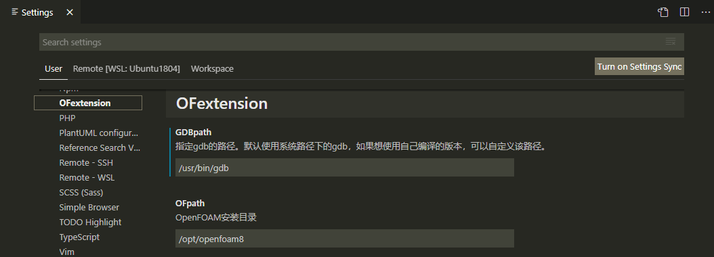
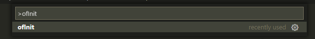

# OFextension

## 1 介绍
VSCode的OpenFOAM插件。本插件依托于C/C++插件，用于快速部署开发环境以适配OpenFOAM求解器代码。
代码跳转、悬浮提示、调试等功能是写求解器所必备的功能，本插件基于自己的一点理解所开发，对小白友好，一键完成部署。

## 2 快速开始
- 在插件设置中指定OpenFOAM和gdb的路径 (Settings-> Extensions: OFextension中的`OFpath`和`GDBpath`)；

- 按`F1`或`Ctrl+Shift+P`打开命令面板，搜索并运行`ofInit`命令；

- 调试前请初始化算例（如清理算例、网格生成等，这很关键！），然后按键`F5`或通过调试面板启动调试。

**视频演示**

[VS Code的OpenFOAM插件(OFextension)演示](https://www.bilibili.com/video/BV1RX4y1g752/)

**原理参考**

- [利用VS Code阅读源码及调试OpenFOAM](http://www.xfy-learning.com/2021/01/05/%E5%88%A9%E7%94%A8VS-Code%E9%98%85%E8%AF%BB%E6%BA%90%E7%A0%81%E5%8F%8A%E8%B0%83%E8%AF%95OpenFOAM/)
- [OFprimer: 6.2 Debugging and profling](https://www.researchgate.net/publication/267569764_The_OpenFOAM_Technology_Primer)  

## 3 安装教程
### 3.1 依赖
- C/C++插件
```
Name: C/C++  
Id: ms-vscode.cpptools  
Description: C/C++ IntelliSense, debugging, and code browsing.  
Publisher: Microsoft  
```
- 调试需要gdb  

可以通过系统包管理器安装，比如Ubuntu下：
```sh 
sudo apt update
sudo apt install gdb -y
```
也可以选择自己编译的版本。

### 3.2 离线安装
按F1，搜索vsix，选择Extensions: Install from VSIX...，选择ofextension_vxxx.vsix即可

### 3.3 Extension Marketplace中搜索安装
搜索`OFextension`，安装即可。

## 4 架构
待补充

## 5 参与贡献

1.  Fork 本仓库
2.  新建 Feat_xxx 分支
3.  提交代码
4.  新建 Pull Request
