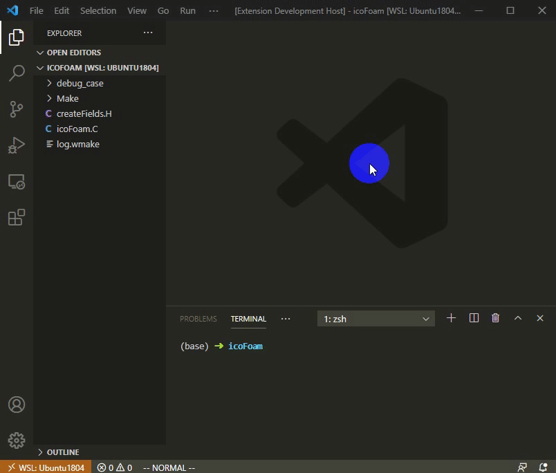
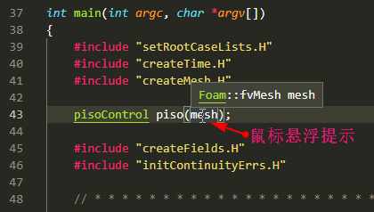
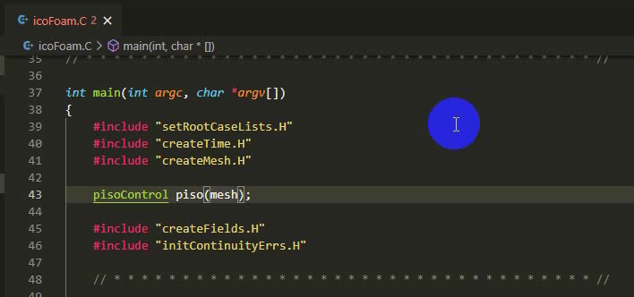
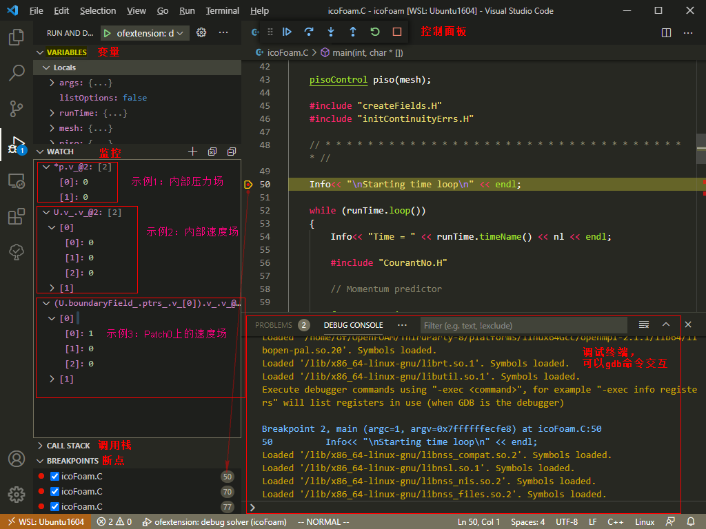

# OFextension

## 1 介绍

VSCode的OpenFOAM插件。本插件依托于C/C++插件，用于快速部署开发环境以适配OpenFOAM求解器代码。
代码跳转、悬浮提示、调试等功能是写求解器所必备的功能，本插件基于自己的一点理解所开发，对小白友好，一键完成部署。

[代码仓库](https://gitee.com/xfygogo/ofextension)

## 2 快速开始
- 在插件设置中指定OpenFOAM和gdb的路径 (Settings-> Extensions: OFextension中的`OFpath`和`GDBpath`)；  

务必确保在`OFpath`中正确指定了自己的OpenFOAM路径。如果不需要调试，就不用管`GDBpath`
- 按`F1`或`Ctrl+Shift+P`打开命令面板，搜索并运行`ofInit`命令；  

- 调试前请初始化算例（如清理算例、网格生成等，这很关键！），然后按键`F5`或通过调试面板启动调试。

### 2.1 特性展示
- 语法高亮与鼠标悬浮提示  

- 代码跳转 (<font color=red>阅读源码很有用！</font>)

- 调试  


<details style="border:1px solid #dbebdf; padding:10px; border-radius:10px">
<summary> <font color=red>!!!有关OF调试的重要说明　</font> (比较复杂，有需要的点击展开查看) </summary>

OpenFOAM通过源码编译安装时有三个模式可以选择，即`$WM_COMPILE_OPTION=Opt|Debug|Prof`。
其中`Opt`是默认的模式，其编译过程会调用编译器优化，最终得到的程序体积相对更小，执行效率相对也最高。
`Debug`模式则会包含更多额外的信息用于调试查看，因此在此模式下编译最终得到的程序体积最大，执行效率也更低。
`Prof`模式编译的程序可用于性能分析，相比`Opt`的程序也需要引入额外开销。
通过系统自带的包管理器(比如Ubuntu的apt)安装的OpenFOAM一般都是在`Opt`模式下编译得到然后打包的。
我们正常编译安装也是如此（自己编译安装是可以控制该选项的！可以得到特定模式下的程序，因此更自由！）。

为了便于分析，这里我将OpenFOAM编译的内容区分为`应用程序`（对应`application`目录中的内容）
与`库`（对应`src`目录中的内容）。原则上，<font color=red>要调试的程序必须是在`Debug`模式下编译的才行</font>。那是不是用包管理器编译安装的OpenFOAM或者自己用默认的`Opt`模式编译的OpenFOAM就不能调试了呢？
也不绝对是这样。
考虑一种最常见的情况：`库Opt+应用程序Debug`。这时候是可以启动调试器的，只不过有些情况下无法深入查看库中的内容。拿速度场`U`来举例，如果我们想查看`U.name()`的值，此时就会无返回结果。原因在于`name_`属性继承自`IOobject`，在`库`中它使用的是`Opt`模式来编译的。但是在这种情况下却可以查看速度场在网格中或者边界上的值。因此如果你不想使用`Debug`模式重新编译一遍OpenFOAM，那么就可以使用这种特殊的组合方式来调试（即库采用默认的Opt模式，求解器使用Debug模式编译），但同时需要认识到这种模式的缺陷（遇到问题的时候自然就知道了，比如无法正常使用`gdbof`的完整功能）。

因此该插件中给出了两个额外的配置项：`OFbuildopt`和`OFdebugopt`，分别用来指定用于正常编译运行（算case）以及用于调试的变量设置。两者都可以指定WM_COMPILER、WM_MPLIB、WM_NCOMPPROCS、FOAMY_HEX_MESH、WM_NCOMPPROCS等选项（按照自己编译是给定的值设置即可）。`OFdebugopt`影响最终调试如何进行。
以自编译的$HOME/OpenFOAM/OpenFOAM-8为例，如果`OFdebugopt`设置为`WM_COMPILE_OPTION=Debug`，那最终的激活环境的命令为`source $HOME/OpenFOAM/OpenFOAM-8/etc/bashrc WM_COMPILE_OPTION=Debug`，这时候`$FOAM_USER_APPBIN`会指向`.../linux64GccDPInt32Debug`，即所有的库以及该求解器都需要使用`Debug`模式编译才行。如果`OFdebugopt`设置为`; export WM_COMPILE_OPTION=Debug`，那最终调用的激活环境的命令为`source $HOME/OpenFOAM/OpenFOAM-8/etc/bashrc; export WM_COMPILE_OPTION=Debug`，这时候`$FOAM_USER_APPBIN`会指向`.../linux64GccDPInt32Opt`，即这种情况下后一句export命令并没有影响到前一句环境，即OF主体上还是`Opt`模式的，相关的环境变量也都会是带有`Opt`的，在此之后`Debug`模式才生效，最终的效果就是`库Opt+求解器Debug`（也就是前面分析过的情况）。

分析了这么多，总结来说 `库Opt+应用程序Debug`情况下的调试算是一种部分调试（本插件默认的配置就属于这种情况），主要针对`应用程序`部分的，而整个OF完全在Debug模式下编译，即`库Debug+应用程序Debug`情况下的调试是完整调试，对`应用程序`和`库`代码都有效。

</details>

### 2.2 视频演示

[VS Code的OpenFOAM插件(OFextension)演示](https://www.bilibili.com/video/BV1RX4y1g752/)

- Step1. 拷贝求解器， 修改Make/files（注意：保证EXE输出到有权限的路径下）
```sh
# 激活OpenFOAM环境
$ of8
$ foamVersion
OpenFOAM-8
# 切换到求解器目录
$ run
$ cd ../solver
# 拷贝要调试的求解器和测试算例
$ cp $FOAM_SOLVERS/incompressible/icoFoam -r .
$ cd icoFOAM
$ sed -i 's/FOAM_APPBIN/FOAM_USER_APPBIN/g' 
```

- Step2. 拷贝算例、算例初始化（网格生成等，每次调试前都需要注意算例的状态）
```sh
$ cp $FOAM_TUTORIALS/incompressible/icoFOAM/cavity/cavity -r debug_case
$ cd debug_case
$ foamCleanTutorials && blockMesh 2>&1 | tee log.blockMesh
$ cd ..
```
- Step3. 运行ofInit。
按F1，搜索并运行ofInit。等待片刻，`.vscode`中会自动生成相关配置文件。这里需要查看相关的日志文件`log.wmake*`，确保没有报错。


### 2.3 相关参考

- [利用VS Code阅读源码及调试OpenFOAM](http://www.xfy-learning.com/2021/01/05/%E5%88%A9%E7%94%A8VS-Code%E9%98%85%E8%AF%BB%E6%BA%90%E7%A0%81%E5%8F%8A%E8%B0%83%E8%AF%95OpenFOAM/)
- [OFprimer: 6.2 Debugging and profling](https://www.researchgate.net/publication/267569764_The_OpenFOAM_Technology_Primer)  

## 3 安装教程
### 3.1 依赖
- OpenFOAM需要在Linux平台使用，本插件适用于Linux平台。使用Remote-WSL或者Remote-SSH连接WSL或者远程Linux服务器也可。
- C/C++插件，用于高亮显示、跳转、鼠标悬浮提示等。
```
Name: C/C++  
Id: ms-vscode.cpptools  
Description: C/C++ IntelliSense, debugging, and code browsing.  
Publisher: Microsoft  
```
- 调试需要gdb。 可以通过系统包管理器安装，比如Ubuntu下：
```sh 
sudo apt update
sudo apt install gdb -y
```
也可以选择自己编译的版本。

### 3.2 离线安装
按F1，搜索vsix，选择Extensions: Install from VSIX...，选择ofextension_vxxx.vsix即可

### 3.3 Extension Marketplace中搜索安装
搜索`OFextension`，安装即可。

## 4 架构
待补充

## 5 参与贡献

1.  Fork 本仓库
2.  新建 Feat_xxx 分支
3.  提交代码
4.  新建 Pull Request
